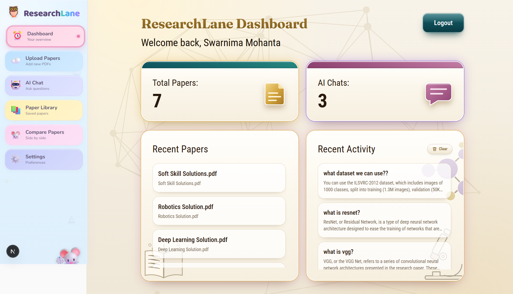
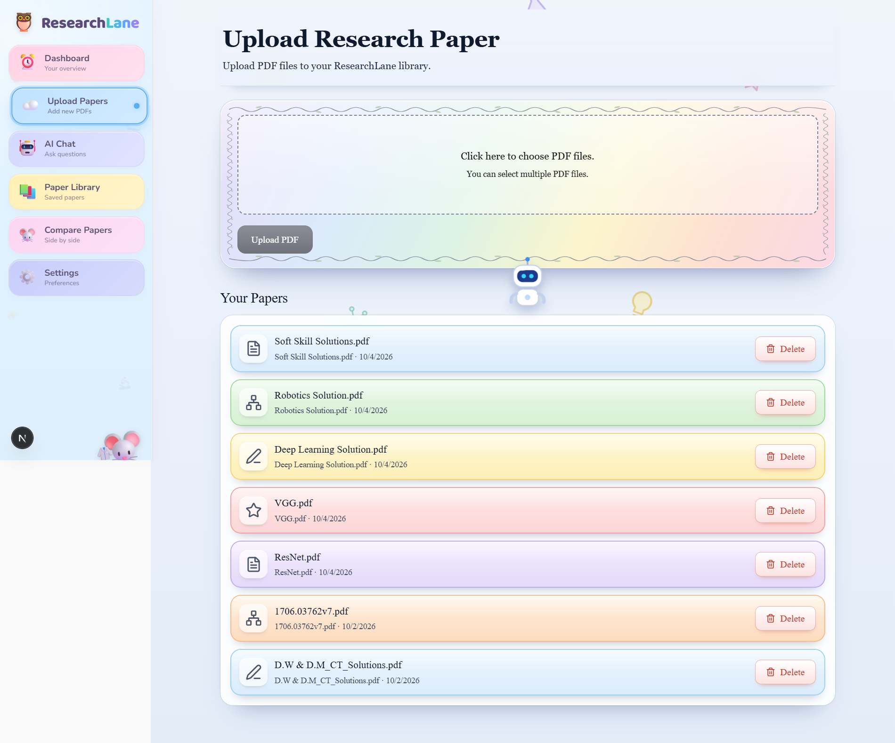
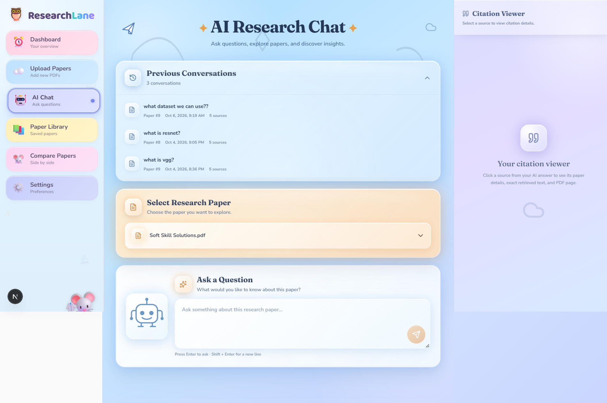
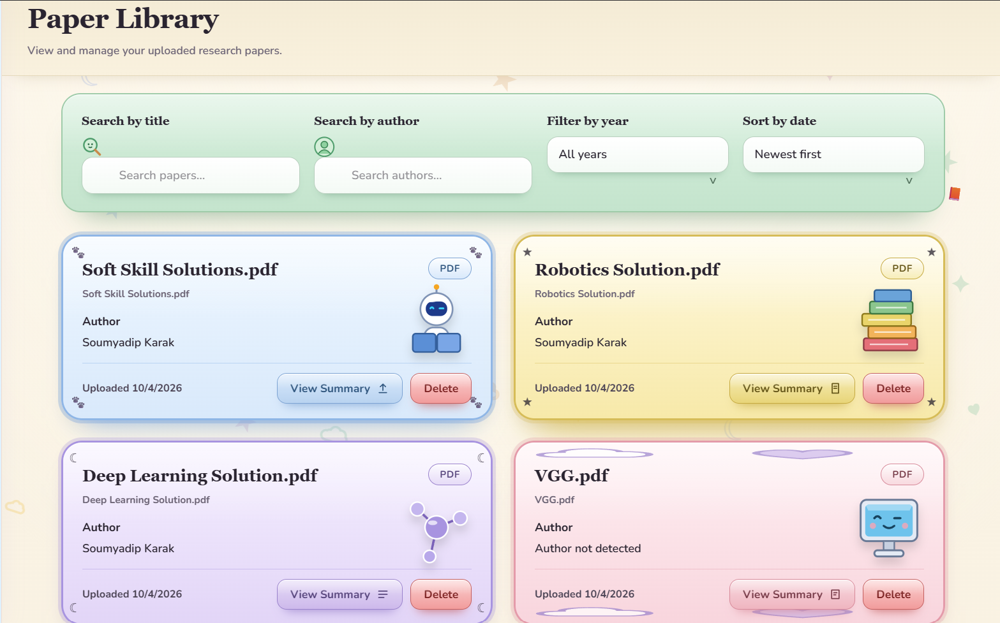

<div align="center">

<h1>🦉 ResearchLane</h1>
<h3>AI Assistant for Research Paper Analysis</h3>

<p>
Upload research papers, chat with them, get cited answers, and compare papers side by side.
</p>

<p>
  
  
  
  
  
  
  
</p>


</div>

<br />

## 📖 About

<p>
<b>ResearchLane</b> is an AI-powered research paper analysis tool built on a
<b>Retrieval-Augmented Generation (RAG)</b> pipeline. Users sign in, upload PDF papers
to a personal library, ask questions about a paper in natural language, inspect the source text
behind each answer, and compare two papers using an AI-generated analysis.
</p>

<p>
The language model runs <b>locally through Ollama</b>, so no paper content is sent to an external LLM API.
</p>

<p>
It was developed as a B.Tech capstone project (Computer Science &amp; Engineering, AI &amp; ML) at Brainware University.
</p>

> **Status:** ResearchLane is a working local prototype. Core features are implemented, but it has not been fully tested or deployed to production.

---

## ✨ Features

<table>
  <tr>
    <td width="33%" valign="top">
      <h4>🔐 Authentication</h4>
      JWT-based authentication with Google OAuth. Each user's papers are stored separately.
    </td>
    <td width="33%" valign="top">
      <h4>📊 Dashboard</h4>
      Overview of total papers and AI chats, plus recent papers and recent activity (with a clear option).
    </td>
    <td width="33%" valign="top">
      <h4>📤 Upload Papers</h4>
      Upload one or multiple PDF files and manage them from a "Your Papers" list.
    </td>
  </tr>
  <tr>
    <td valign="top">
      <h4>📚 Paper Library</h4>
      Search by title or author, filter by year, sort by date, view a summary of each paper, or delete it. Authors are detected automatically.
    </td>
    <td valign="top">
      <h4>💬 AI Research Chat</h4>
      Pick a paper, ask questions, and revisit previous conversations. Answers are generated from retrieved passages of the selected paper.
    </td>
    <td valign="top">
      <h4>📎 Citation Viewer</h4>
      Click a source in an answer to see the paper details, the retrieved text, and the PDF page it came from.
    </td>
  </tr>
  <tr>
    <td valign="top">
      <h4>⚖️ Compare Papers</h4>
      Select two papers and get an AI-generated comparison: similarities, differences, methodology, datasets, results, and a final analysis.
    </td>
    <td valign="top"></td>
    <td valign="top"></td>
  </tr>
</table>

---

## 🖼️ Screenshots

### 1. Dashboard

<p align="center">
  
</p>

The landing page after login. It greets the user and shows the total number of papers and AI chats. Below that, the Recent Papers and Recent Activity panels show the latest uploads and questions, and Recent Activity can be cleared.

### 2. Upload Papers

<p align="center">
  
</p>

Users choose one or more PDF files and upload them with a single click. The "Your Papers" list below shows every uploaded paper with its upload date and a Delete button.

### 3. AI Chat

<p align="center">
  
</p>

Users select a paper and ask questions about it in natural language. Earlier conversations are listed under Previous Conversations, and clicking a source opens the Citation Viewer on the right to show the paper details, the retrieved text, and the PDF page.

### 4. Paper Library

<p align="center">
  
</p>

All uploaded papers appear as cards showing the title, detected author, and upload date. Users can search by title or author, filter by year, sort by date, open a paper's summary, or delete it.

### 5. Compare Papers

<p align="center">
  
</p>

Users pick Paper A and Paper B and click Compare Papers. ResearchLane then generates an AI comparison split into Similarities, Differences, Methodology, Datasets, Results, and a Final AI Analysis.

---

## 🛠️ Tech Stack

| Layer | Technology |
|-------|------------|
| Frontend | Next.js, React, TypeScript |
| Backend | FastAPI, Python 3.11 |
| LLM | Qwen2.5-7B-Instruct, run locally via Ollama |
| Embeddings | `BAAI/bge-base-en-v1.5` |
| Vector Database | ChromaDB |
| PDF Parsing | PyMuPDF (`fitz`) |
| Text Chunking | LangChain `RecursiveCharacterTextSplitter` |
| Database | SQLite (local development), PostgreSQL planned for production |
| Authentication | Google OAuth, JWT |

---

## 🧠 How It Works

1. **Upload**: the user uploads a research paper PDF.
2. **Text extraction**: PyMuPDF extracts the text and page information.
3. **Chunking**: the text is split into smaller segments with LangChain's recursive text splitter.
4. **Embedding**: `BAAI/bge-base-en-v1.5` converts the chunks into vectors.
5. **Indexing**: ChromaDB stores the vectors, text, and metadata.
6. **Retrieval**: a question is embedded with the same model, and ChromaDB returns the most semantically similar chunks.
7. **Generation**: the retrieved context and the question are sent to Qwen2.5-7B-Instruct through Ollama.
8. **Response**: the answer is returned together with the sources that were retrieved, which can be opened in the Citation Viewer.

Comparison and summaries build on the same architecture, using different prompts and retrieval scopes.

> ⚠️ Answers are generated by a local 7B language model from retrieved passages. They can be incomplete or wrong, so verify important claims against the cited source in the paper.

---

## 📁 Project Structure

```text
ResearchLane/
├── .env
├── backend/
│   ├── alembic/
│   │   └── versions/
│   ├── app/
│   │   ├── api/          # auth, papers, dashboard routes
│   │   ├── auth/
│   │   ├── models/       # user, paper, chat
│   │   ├── services/     # compare service
│   │   ├── parser/
│   │   ├── rag/
│   │   ├── embeddings/
│   │   ├── vector_db/
│   │   ├── database/
│   │   └── main.py
│   └── requirements.txt
└── frontend/
    ├── app/              # dashboard, login, register, chat, library, ...
    ├── components/
    ├── lib/
    ├── store/
    ├── public/
    └── package.json
```

<!-- TODO: verify this tree against the actual repository before publishing -->

---

## 🚀 Getting Started

### Prerequisites

- Python 3.11
- Node.js <!-- TODO: add the version from `node -v` -->
- [Ollama](https://ollama.com/) with the Qwen2.5-7B-Instruct model pulled <!-- TODO: add the exact `ollama pull` model tag you use -->
- A Google OAuth client ID and secret

### 1. Clone the repository

```bash
git clone <!-- TODO: your repo URL -->
cd ResearchLane
```

### 2. Backend

From the project root (using the Python 3.11 virtual environment in `.venv`):

```powershell
cd backend
..\.venv\Scripts\Activate.ps1
python -m uvicorn app.main:app --reload
```

<!-- TODO: add the dependency install step if needed, e.g. pip install -r requirements.txt -->

The API runs at `http://localhost:8000` and the interactive docs are at `http://localhost:8000/docs`.

### 3. Frontend

In a second terminal:

```powershell
cd frontend
npm install
npm run dev
```

The app runs at `http://localhost:3000`.

### 4. Environment variables

Create a `.env` file (never commit real secrets).

| Variable | Purpose |
|----------|---------|
| `NEXT_PUBLIC_API_URL` | Frontend base URL for the backend API |

<!-- TODO: add your Google OAuth, JWT and database variable names (names only, no values) -->

---

## 🗺️ Project Status

| Feature | Status |
|---------|--------|
| Project setup and architecture | ✅ Done |
| JWT authentication | ✅ Implemented |
| Google OAuth | ✅ Implemented |
| Dashboard | ✅ Implemented |
| PDF upload and processing | ✅ Implemented |
| Paper library | ✅ Implemented |
| AI chat and chat history | 🚧 Implemented, being refined |
| Citation display | 🚧 Implemented, being refined |
| Paper comparison | 🚧 Implemented, being debugged |
| Paper summaries | 🚧  Implemented, being refined|
| Testing and deployment | 📅 Planned |

---

## 👩‍💻 Author

**Swarnima Mohanta**
